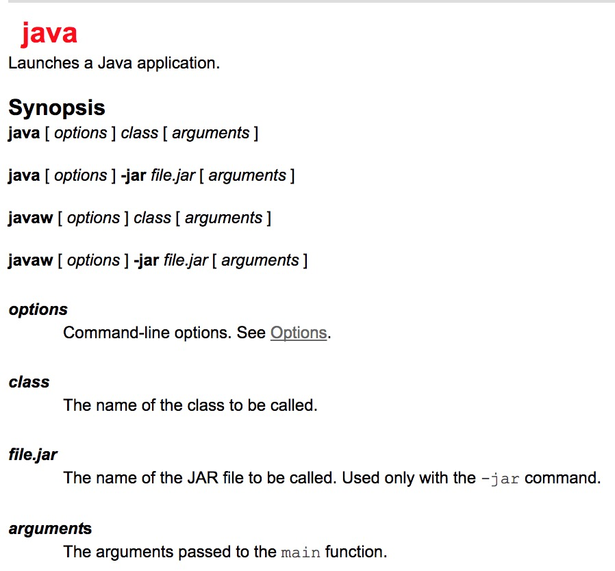
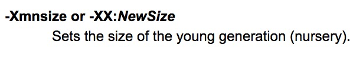

## 以下是java启动命令的语法说明:
（[官方文档说明](https://docs.oracle.com/javase/7/docs/technotes/tools/windows/java.html)）

## 以下是[options]的说明以及一些常用的:

**Standard Options** 所有运行环境都支持

* -D 用于设置系统变量，由于spring boot会从系统属性读取属性，所以使用`@Value("myDir")`即可获取。

* -jar 用于指定启动的jar文件，jar文件的manifest必须知道Main-Class

**Nonstandard Options** 由Java HotSpot VMs默认提供

* -Xmn 设置新生代的大小

* -Xms 设置内存分配池的最小值，即初始值

* -Xmx 设置内存分配池的最大值

对于服务器部署，-Xms和-Xmx通常设置为相同的值。

## 以下是[arguments]说明：

语法为**--{name}={value}**

例如：
`java -jar app.jar --name="Spring"` 。由于spring boot会从command line argument读取属性，所以使用`@Value("name")`即可获取。

